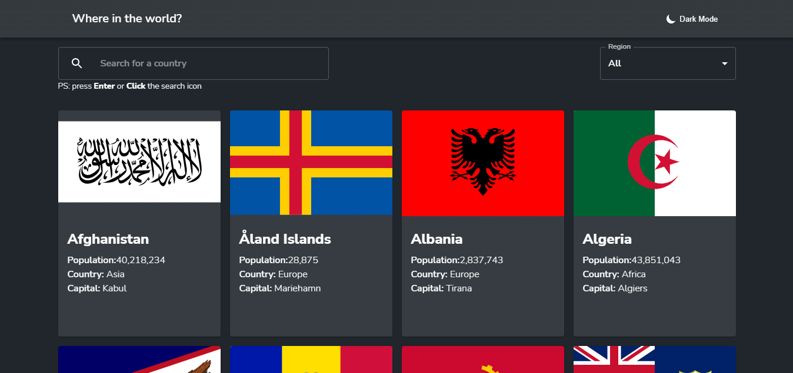

# Frontend Mentor - REST Countries API with color theme switcher solution

This is a solution to the [REST Countries API with color theme switcher challenge on Frontend Mentor](https://www.frontendmentor.io/challenges/rest-countries-api-with-color-theme-switcher-5cacc469fec04111f7b848ca). Frontend Mentor challenges help you improve your coding skills by building realistic projects.

## Table of contents

- [Overview](#overview)
  - [The challenge](#the-challenge)
  - [Screenshot](#screenshot)
  - [Links](#links)
- [My process](#my-process)
  - [Built with](#built-with)
  - [What I learned](#what-i-learned)
  - [Continued development](#continued-development)
- [Author](#author)

## Overview

### The challenge

Users should be able to:

- See all countries from the API on the homepage
- Search for a country using an `input` field
- Filter countries by region
- Click on a country to see more detailed information on a separate page
- Click through to the border countries on the detail page
- Toggle the color scheme between light and dark mode _(optional)_

### Screenshot

### Links

- Live Site URL: [Add live site URL here](https://rest-country-api-9we0pctzq-ibrahimmmourad97.vercel.app/)

## My process

### Built with

- [React](https://reactjs.org/) - JS library
- Semantic HTML5 markup
- CSS custom properties
- Material UI
- Mobile-first workflow

### What I learned

- I Practiced React Hooks (useReducer,useContext)
- Created Light and Dark Theme using Material UI
- Saved Theme Choice in Cookies

### Continued development

There's so much more about React and its ecosystem, i'd like to know more code structures and decide what's the best way to go based on the project. I'm interested in learning React styled components as well.

## Author

- Frontend Mentor - [@IbrahimMourad](https://www.frontendmentor.io/profile/IbrahimMourad)
- Linkedin - [@IbrahimMourad](https://www.linkedin.com/in/ibrahimmourad97/)
- Twitter - [@IbrahimMourad](https://www.twitter.com/Di_Maria97)
